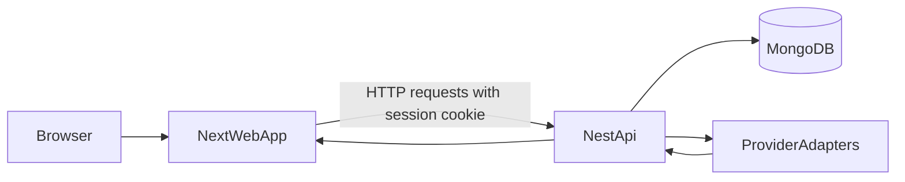
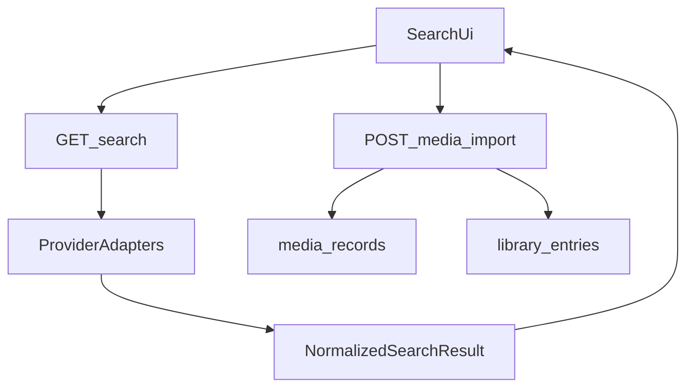

# Architecture

## Overview

`Media Library Manager` is a monorepo with a clear web/API boundary:

- `apps/web` renders the UI and handles browser-only concerns
- `apps/api` owns auth, sessions, provider access, normalization, caching, and persistence
- `packages/types` defines shared request, response, and domain contracts
- `packages/provider-sdk` holds provider-facing contracts and normalization helpers

This separation is intentional. The frontend never talks to TMDB, MusicBrainz, Open Library, RAWG, or Discogs directly.

## Monorepo Shape

```txt
apps/
  api/            NestJS API, Mongo models, provider adapters
  web/            Next.js App Router UI
packages/
  config/         Shared config helpers
  provider-sdk/   Provider contracts and mapping utilities
  types/          Shared TypeScript contracts
```

## System Flow



## Web App Responsibilities

The web app is responsible for:

- rendering public auth pages and protected app routes
- collecting user input for manual entry, search, and scan flows
- showing loading, empty, and error states
- sending authenticated requests to the API
- localizing the interface for `en` and `ja`

The web app is not responsible for:

- provider authentication or rate limiting
- metadata normalization
- barcode lookup orchestration
- permission checks beyond route gating UX

## API Responsibilities

The API is responsible for:

- username/password auth
- session creation, validation, and logout
- scoping protected routes to the current user
- storing normalized `media_records`
- storing user-owned `library_entries`
- fan-out provider search
- provider-backed import and refresh
- barcode lookup against local data and providers
- provider response caching
- health reporting for deployment checks

## Auth And Session Boundary

Auth is session-cookie based.

- the API sets an HTTP-only cookie
- the raw session token is never stored directly in Mongo
- the API stores a hashed token in the `sessions` collection
- protected routes rely on the global session guard

This keeps auth simple for a private app while still demonstrating production-minded session handling.

## Search And Import Flow



Key rule:

- provider data is normalized into internal shapes before it becomes part of the app's stored model

## Barcode Flow

Barcode scanning is designed as input acceleration, not auto-match automation.

1. The web app reads a UPC/EAN style barcode from the camera.
2. The API checks local matches and provider-backed candidates.
3. The API returns candidate matches plus fallback hints.
4. The user explicitly selects a result and chooses `catalog` or `wishlist`.

This keeps the UX safer for ambiguous or weak barcode coverage.

## Persistence Model

The data model is split on purpose:

- `library_entries` stores user-specific collection state
- `media_records` stores normalized shared metadata snapshots

That separation allows the same media record to be reused across entries while keeping personal notes, tags, purchase info, and bucket assignment user-owned.

See [`docs/data-model.md`](./data-model.md) for the collection-level breakdown.

## Deployment Shape

The repo supports two main operational modes:

- local Docker development with `web`, `api`, and `mongo`
- production-style Docker deployment with app images and either Atlas, external Mongo, or an optional bundled Mongo profile

The API exposes `GET /health`, and both Compose files use it for readiness checks.

See [`docs/deployment.md`](./deployment.md) for the exact commands and env expectations.
