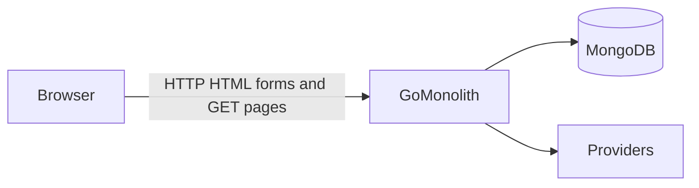

# Architecture

## Overview

`Media Library Manager` ships as a **single Go application**:

- **HTTP server** — [`github.com/go-chi/chi/v5`](https://github.com/go-chi/chi) in [`internal/app/app.go`](../internal/app/app.go)
- **Rendering** — `html/template` with embedded or on-disk templates under [`internal/views`](../internal/views)
- **Static assets** — [`internal/static`](../internal/static), embedded when `APP_ENV=production`
- **Persistence** — MongoDB via the official Go driver, [`internal/repository`](../internal/repository)
- **Providers** — [`internal/providers`](../internal/providers) (TMDB, MusicBrainz, Discogs, Open Library, RAWG)
- **Business logic** — [`internal/service`](../internal/service)

The browser does not call TMDB, MusicBrainz, Open Library, RAWG, or Discogs directly. All provider traffic is server-side.

## Rendering and client interaction

The default interaction model is **server-rendered HTML**: full pages from `html/template`, semantic forms, and links. The app is **HTML-first**; it is **not** a client-side SPA. JavaScript is **used where it helps**, not avoided on principle.

- **htmx** — loaded in the authenticated shell; same routes may return **fragments** when `HX-Request` is present (search results, list sections, pagination, inline notices). See [`docs/templates.md`](./templates.md).
- **Vanilla JS** — **`/static/js/scan.js`** and vendored ZXing for the scan page; small scripts only as needed. Canonical catalog rules and provider access remain in Go.

Auth and session cookies apply to both full and partial responses.

## Repository shape

```txt
cmd/web/           main()
internal/
  app/             wiring: router, services, renderer
  config/          environment loading
  db/              Mongo client
  domain/          domain types and enums
  http/            handlers, middleware
  providers/       external APIs + throttling
  repository/      Mongo collections
  service/         auth, library, media, search, barcode, reliability
  views/           templates, locales
  static/          CSS, JS (e.g. scan), embed
```

## System flow



## Responsibilities

- **Routes and middleware** — locale prefix, logging, recovery, session cookie, auth gate for protected pages.
- **Auth** — register, login, logout; sessions stored in MongoDB; password hashing with `golang.org/x/crypto`.
- **Library** — `catalog` / `wishlist`, manual entries, detail and edit flows.
- **Search** — provider fan-out, normalized results, links into import/attach flows.
- **Import** — create or reuse `media_records`, attach `library_entries`, dedupe in the media service.
- **Barcode** — orchestrated lookup, optional `scan_logs`, never auto-saves library state.
- **Localization** — English and Japanese presentation strings in [`internal/views/locales`](../internal/views/locales).

## Persistence model

- **`library_entries`** — user-owned collection state (bucket, notes, tags, format, etc.).
- **`media_records`** — normalized shared metadata and provider references.

See [`docs/data-model.md`](./data-model.md).

## Deployment shape

- **Development on host:** `./scripts/dev-db-up.sh` (Mongo in Docker) + `./scripts/dev-web.sh` with `APP_ENV=development` loads templates from disk for fast iteration.
- **Production:** root `Dockerfile` + [`docker-compose.prod.yml`](../docker-compose.prod.yml). Local [`docker-compose.yml`](../docker-compose.yml) is **MongoDB only** for dev.

See [`docs/deployment.md`](./deployment.md).

Further reading: [`docs/spec.md`](./spec.md), [`docs/routes.md`](./routes.md).
