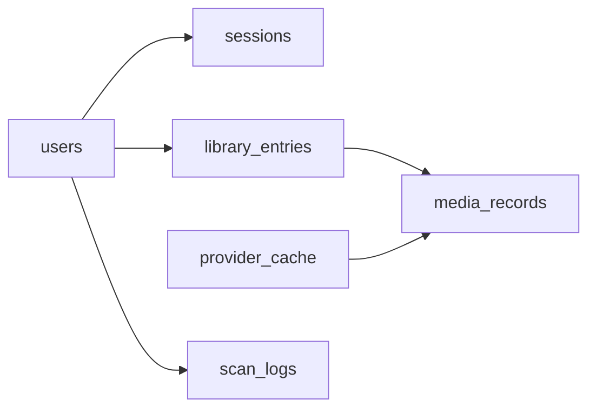

# Data Model

## Core Principle

The model separates user-owned collection state from imported media metadata.

- `library_entries` answers: "What does this user own or want?"
- `media_records` answers: "What normalized metadata do we know about this title?"

That split keeps personal data, notes, tags, and purchase details independent from provider snapshots.

## Collections

## `users`

Stores account identity and profile-level settings.

Typical fields:

- `username`
- `passwordHash`
- optional `displayName`
- `settings`
- timestamps

Notes:

- login identity is username-based
- profile visibility is fixed to `private` in v1

## `sessions`

Stores active browser sessions.

Typical fields:

- `userId`
- `tokenHash`
- `expiresAt`
- `lastUsedAt`
- optional request metadata such as user agent and IP

Notes:

- the raw session token is stored in the cookie, not the database
- the database stores a hashed token
- the collection uses expiry semantics through `expiresAt`

## `library_entries`

Stores user-specific library rows.

Typical fields:

- `userId`
- `mediaRecordId`
- `bucket`
- `mediaType`
- optional `format`
- optional `barcode`
- optional `purchaseDate`
- optional `notes`
- `tags`
- timestamps

These fields are what make one user's copy different from another user's copy of the same title.

## `media_records`

Stores normalized metadata snapshots shared across library entries.

Common fields:

- `source`
- `mediaType`
- `title`
- optional `sortTitle`
- optional `releaseDate`
- optional `year`
- optional `imageUrl`
- optional `summary`
- `providerRefs`
- optional `externalRatings`
- optional `barcodeCandidates`
- optional `lastSyncedAt`
- timestamps

Subtype details live in a `details` object keyed by `mediaType`.

### Media Type Details

- `movie`: runtime, directors, cast, genres
- `tv`: seasons, episodes, creators, genres
- `album`: artists, label, track count, release country, catalog number
- `book`: authors, ISBN values, publisher, page count
- `game`: platforms, developers, publishers, genres

## `provider_cache`

Stores cached provider responses.

Purpose:

- reduce duplicate provider calls
- smooth over provider reliability issues
- protect integrations with stricter rate limits such as MusicBrainz

Typical fields:

- `provider`
- `cacheKey`
- `payload`
- `expiresAt`

## `scan_logs`

Stores barcode lookup history.

Purpose:

- capture scan attempts
- support future debugging or analytics
- keep barcode workflow state separate from user-facing library rows

Typical fields:

- `userId`
- `barcode`
- optional matched media type
- optional matched provider
- timestamp

## Relationship Summary

## Why This Shape Works Well

- it avoids duplicating provider metadata across every user entry
- it preserves a clean ownership boundary for user notes and tags
- it supports provider refresh without rewriting the user-facing library model
- it leaves room for better deduplication and richer provider syncing later

## Type definitions in code

Domain shapes for the Go app live under [`internal/domain`](../internal/domain) and repository documents under [`internal/repository`](../internal/repository). MongoDB stores the canonical documents described throughout this doc.
